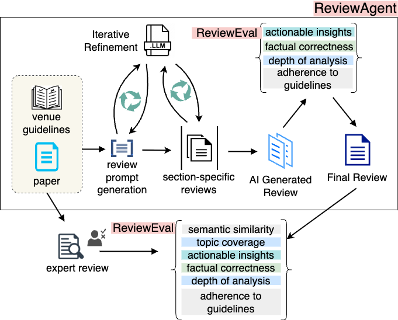

## ReviewEval: An Evaluation Framework for AI-Generated Reviews

### Paper - [ReviewEval](https://arxiv.org/abs/2502.11736)
### Accepted at Findings of EMNLP 2025!


### Abstract
The escalating volume of academic research, coupled with a shortage of qualified reviewers, necessitates innovative approaches to peer review. In this work, we propose: ❶ ReviewEval, a comprehensive evaluation framework for AI-generated reviews that measures alignment with human assessments, verifies factual accuracy, assesses analytical depth, identifies degree of constructiveness and adherence to reviewer guidelines; and ❷ ReviewAgent, an LLM-based review generation agent featuring a novel alignment mechanism to tailor feedback to target conferences and journals, along with a self-refinement loop that iteratively optimizes its intermediate outputs and an external improvement loop using ReviewEval to improve upon the final reviews. ReviewAgent improves actionable insights by 6.78% and 47.62% over existing AI baselines and expert reviews respectively. Further, it boosts analytical depth by 3.97% and 12.73%, enhances adherence to guidelines by 10.11% and 47.26% respectively. This paper establishes essential metrics for AI-based peer review and substantially enhances
the reliability and impact of AI-generated reviews in academic research.


## TL;DR
- End-to-end pipeline to generate venue-aligned reviews and evaluate them with modular, research-grade metrics.
- Two components: ReviewAgent (generator) and ReviewEval (evaluator).


## Highlights
- Venue-guided review generation with cached guideline parsing and section prompts
- Automated formatting into conference-style reviews; optional reflection-based improvement and ReviewEval based improvement
- Evaluation metrics: depth of analysis, actionable insights, adherence to guidelines, factual correctness, AI–human alignment (topic coverage and semantic similarity)


## Architecture

- ReviewAgent (generation)
  - `review_prompts_generator.py`: Parse guidelines → section prompts (cached)
  - `gemini.py`: PDF parsing + LLM I/O helpers with retries and truncation
  - `reflection.py`: Self-refinement loop
  - `automate_review.py`: Orchestrates section synthesis → formatting → (optional) improvements

- ReviewEval (evaluation)
  - `depth_of_analysis.py`: Five sub-criteria → normalized depth score
  - `actionable_insights.py`: Specificity, feasibility, implementation detail → % actionable
  - `adherence.py`: Auto-extracted criteria from guidelines → normalized adherence
  - `factual_correctness.py`: RAG over paper PDF → supported/nullified negatives → factual score
  - `ai_human.py`: Topic coverage + embedding similarity vs expert reviews

---

## Quick Start
Requires Python 3.10+.

1) Environment
```bash
python3 -m venv .venv && source .venv/bin/activate
pip install -r requirements.txt
pip install scikit-learn matplotlib seaborn statsmodels nltk openai
```

2) Credentials
```bash
export OPENAI_API_KEY=YOUR_KEY
# Optional
export OPENROUTER_API_KEY=YOUR_KEY
export ANTHROPIC_API_KEY=YOUR_KEY
```

3) Configure
Edit `config.py`:
- `input_folder`: Paper to be reviewed PDFs (e.g., `papers/30-papers`)
- `output_folder`: where generated reviews are saved
- `sections`: review sections to generate and merge
- `reflection_loops`, `improvements`, `model`

4) Generate Reviews
```bash
python automate_review.py
```

5) Evaluate Reviews → CSV
Update paths in `evaluation/main.py` and run:
```bash
python -m evaluation.main
```
---

## Citing ReviewEval

```
@misc{garg2025reviewevalevaluationframeworkaigenerated,
      title={ReviewEval: An Evaluation Framework for AI-Generated Reviews}, 
      author={Madhav Krishan Garg and Tejash Prasad and Tanmay Singhal and Chhavi Kirtani and Murari Mandal and Dhruv Kumar},
      year={2025},
      eprint={2502.11736},
      archivePrefix={arXiv},
      primaryClass={cs.CL},
      url={https://arxiv.org/abs/2502.11736}, 
}
```


## Data Layout
Default expectations (override in `config.py` / scripts):
- Papers: `papers/<N>-papers/NNN.pdf`
- Reviews out: `our_reviews/<N>-papers/<model>_reflections_<k>/NNN.txt`
- Guidelines cache: `guidelines_cache/`  |  Prompt cache: `prompt_cache/`
- Results: `results/`

## Repository Structure
- `automate_review.py` · Orchestrate generation pipeline
- `config.py` · Global settings
- `gemini.py` · PDF parsing + LLM helpers (OpenAI via LangChain)
- `reflection.py` · Iterative self-refinement
- `review_prompts_generator.py` · Guideline parsing + prompt generation (cached)
- `prompts.json` · Example cached prompts
- `evaluation/`
  - `main.py`, `model.py`, `depth_of_analysis.py`, `actionable_insights.py`, `adherence.py`, `factual_correctness.py`, `ai_human.py`
- `merge_csv.py`, `process_files.py`, `correlation_analysis.py`
- `requirements.txt`

### Questions? Email: madhav21333@iiitd.ac.in